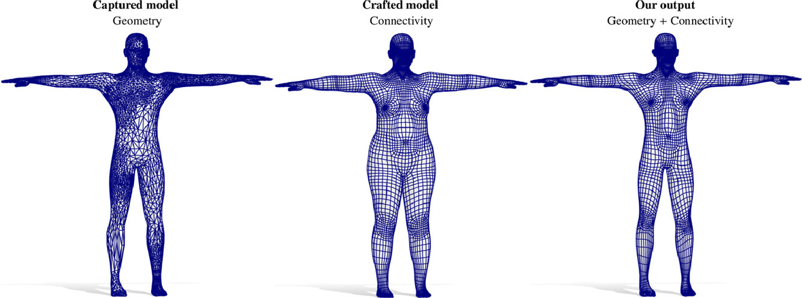

# Intrinsic/extrinsic embedding for functional remeshing of 3D shapes

Melzi, S. and Marin, R. and Musoni, P. and Bardon, F. and Tarini, M. and Castellani, U., C&G 2020

<p align="center">

  
# 2023 - Update!
For recent versions of MATLAB the CPD module has some issues and makes MATLAB crash. We temporarily added a flag to exclude this module in order to complete the execution. 

## Contents
* [Quick-start](https://github.com/PietroMsn/CMH#Quick-start)
* [Requirements](https://github.com/PietroMsn/CMH#requirements)
* [License](https://github.com/PietroMsn/CMH#license)
* [Citation](https://github.com/PietroMsn/CMH#citation)
  
## Quick-start
The example code runs over the couple of meshes inside the directory:
```
shapes/
```

To run the whole pipline you have to run the file: 
```
runme.m
```
You can run different couples of shapes by setting the paths in this file. You have to mantain the variables name in the .mat of the input shapes.


Other directories contain results after each steps and other useful computations (e.g. FMAP correspondence, landmarks, hands and head patches).
  
## Requirements
This code is tested over Windows 10 64bit w\ Matlab 2019a and above. All the required packages are in the two following directories:
```
UtilsFM/
UtilsCMH/
```
You have to include these directory in the environment to run the entire code.
  
## License
Please check the license terms (also of third parts software) before downloading and/or using the code, the models and the data. 
All code and results obtained from it not already covered by other licenses has to be intendend only for non-commercial scientific research purposes.
Any other use, in particular any use for commercial purposes, is prohibited. This includes, without limitation, incorporation in a commercial product, use in a commercial service, or production of other artefacts for commercial purposes including, for example, 3D models, movies, or video games. 
  
  
<h2><a id="user-content-citation" class="anchor" aria-hidden="true" href="#citation"><svg class="octicon octicon-link" viewBox="0 0 16 16" version="1.1" width="16" height="16" aria-hidden="true"><path fill-rule="evenodd" d="M4 9h1v1H4c-1.5 0-3-1.69-3-3.5S2.55 3 4 3h4c1.45 0 3 1.69 3 3.5 0 1.41-.91 2.72-2 3.25V8.59c.58-.45 1-1.27 1-2.09C10 5.22 8.98 4 8 4H4c-.98 0-2 1.22-2 2.5S3 9 4 9zm9-3h-1v1h1c1 0 2 1.22 2 2.5S13.98 12 13 12H9c-.98 0-2-1.22-2-2.5 0-.83.42-1.64 1-2.09V6.25c-1.09.53-2 1.84-2 3.25C6 11.31 7.55 13 9 13h4c1.45 0 3-1.69 3-3.5S14.5 6 13 6z"></path></svg></a>Citation</h2>

If you use this code, please cite the following:

<pre><code>@inproceedings {cmh20193dor,
title = {{CMH: Coordinates Manifold Harmonics for Functional Remeshing}},
author = {Marin, Riccardo and Melzi, Simone and Musoni, Pietro and Bardon, Filippo and Tarini, Marco and Castellani, Umberto},
booktitle = {Eurographics Workshop on 3D Object Retrieval},
year = {2019},
publisher = {The Eurographics Association}
}
</code></pre>


<pre><code>@article{2020intrinsic,
  title={Intrinsic/extrinsic embedding for functional remeshing of 3D shapes},
  author={Melzi, Simone and Marin, Riccardo and Musoni, Pietro and Bardon, Filippo and Tarini, Marco and Castellani, Umberto},
  journal={Computers \& Graphics},
  volume={88},
  pages={1--12},
  year={2020},
  publisher={Elsevier}
}
</code></pre>
